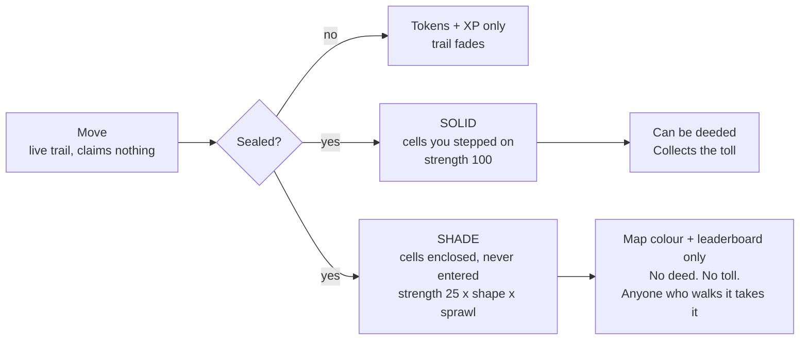

# MovenRun — Game Economy V3

**Status:** design, decided. Supersedes the 31 Aug "Game Economy & Tokenomics v2" PDF,
the 27 Aug master design, and `docs/TOKENOMICS.md` (which documents the *deployed
Sepolia v1 contracts*, a different and older economy).

**Date:** 31 August 2026 · **Chain:** Base · **Token:** one token, `$MOVE`

> This is intended design for a development-stage product. It is not financial,
> investment, legal or tax advice, not an offer, and not a promise of returns.
> `$MOVE` does not trade: no sale, no listing, no liquidity, no allocation.
> Zone deeds are in-game digital assets and confer no real-world property rights.
> Every number marked *hypothesis* is a modelled starting point to be replaced by
> measurement in the pilot.

---

## 0. Review of the v2 proposal — what survives, what changes

The v2 document is the best of the six. Its economic spine is correct and I keep it:
one source of issuance, a fixed capped pool, land paid out of a runner's own reward,
nothing purchasable that earns, locked rewards for free players, a real burn, and a
limits register. Two of its numbers even reconcile properly when you check them —
9M decaying 10% a season to a 2M floor really does sum to 400M over ~180 seasons
(~44 years), which is the gap the 25 Aug brief flagged against itself.

Where v2 is wrong, incomplete, or conflicts with what you have now asked for:

| # | v2 said | V3 rules | Why |
|---|---|---|---|
| R1 | Zones you cross are claimed outright; closing a loop *also* claims the interior | **Nothing is claimed until the route is sealed.** No seal, no colour | You asked for it, and it is the single biggest gamification win available. It turns every session into a hand of cards you have to get home to bank |
| R2 | Enclosed interior claimed "at reduced strength" (unspecified) | **Shade**: a named, weaker state with exact numbers, which anyone can overwrite by physically walking it, and which can never be deeded or collect a toll | Makes "one person runs the ring road, another wins the streets inside" a real rule instead of a hope. Also closes the exploit where one bike lap around a city collects toll from the whole city |
| R3 | Toll split "by share of your reward-bearing route" | **Split by deeded cells crossed per owner.** 4 owners crossed equally → 0.5% each; 8 → 0.25% each | Your rule. It is also simpler to explain and cannot be gamed by GPS sampling rate |
| R4 | *No* cap on player earnings; only "2 scoring sessions/day" and a share-of-pool | **Hard `C_session` and `C_day` ceilings** on top of the share-of-pool | You asked for both, and you are right: pro-rata alone is unbounded per account when the population is small. §9 shows exactly which constraint binds when |
| R5 | Distance has **zero** effect on tokens | Distance has a **concave, saturating** effect inside one session, under a hard ceiling | v2 over-corrected. Telling a runner their extra 30 km is worth literally nothing is a bad product. The farming incentive v2 feared is killed by the ceiling, not by flattening the curve — see §9.2. **This is a change from your v2 ruling; flagged for your sign-off.** |
| R6 | Rewards settle "per period", period undefined | **One settlement per city per day, at day close**, pro-rata across everyone who actually ran that day | Your rule, and it makes the pool visible and social ("2,300 runners out today") |
| R7 | Upkeep charged absentees, mechanism unspecified | **Skip penalty**, auto-debited from the day's reward at settlement, priced off the 4th-root holdings curve | Your rule. Also gives the penalty a source of funds that cannot fail |
| R8 | Gear/repair sinks, plus "no engineered shortfall" | Kept, and made enforceable: **no sink may cost more than the reward that created the need for it** | v2 asserted the principle but gave no rule that stops a future designer breaking it |
| R9 | Wallets "created for you"; embedded wallets "not built" | Auto-provisioned smart account at signup + a **paymaster policy with six named controls** (§13) | The Base Readiness Audit is blunt: zero hits for `paymaster`, `4337`, `bundler` or `gasless` anywhere in the codebase. This is the largest unbuilt dependency in the design |
| R10 | Free players' locked balance stakeable for liquid yield | Kept, but **staking is deferred to Phase 4** and is not part of the launch economy | The integrity review's advice ("prefer no token yield at launch") is right. A yield product on day one is the fastest route to being read as a security |

**What I did not change, and you should resist changing later:** the 1B cap, the
2.00% toll ceiling, "nothing you buy ever earns", the no-retroactive-unlock rule,
`ownerTollMinted == 0`, and never publishing a cell path on-chain. Those five are
load-bearing. Everything else in this document is tuneable.

**The one honest risk in what you have asked for** is R-liquid (§11.3): making all
earnings liquid from the moment someone acquires land is, read plainly, "do a thing,
and your rewards become sellable". The guardrails are that land is *earned through
verified traffic over time and cannot be bought with cash*, and that liquid issuance
is separately capped by real business revenue. That is defensible. It still needs
counsel sign-off per market before Phase 3, and I would not launch it before then.

---

## 1. The eleven rules that never change

1. **Only verified movement creates `$MOVE`.** Not land, not staking, not spending, not referrals.
2. **There will never be more than 1,000,000,000.** No function can raise it.
3. **Nothing is claimed until you seal it.** Get back to where you started, to ground you already own, or cross your own trail.
4. **The toll is 2.00% of a session, once, total** — divided among every deed you crossed, however many there are.
5. **Land pays out of a runner's reward, never out of new supply.** `ownerTollMinted == 0`, checked every settlement.
6. **There is a ceiling on one session and a ceiling on one day**, and the day's ceiling is smaller than two sessions' worth.
7. **Rewards settle once a day**, shared out among the people who actually moved that day.
8. **Nothing you buy earns you anything.** Purchases buy defence, durability, identity and tools.
9. **No sink may cost more than the reward that created the need for it.** Every core loop completes without ever topping up.
10. **Free players' rewards are never sellable, and never become sellable retroactively.**
11. **Your route never goes on-chain.** Not raw GPS, not cell lists, not ever.

---

# PART ONE — THE GAME

## 2. A session

Tap start, move within two seconds. No wallet prompt, no chain jargon, no setup. Walk,
run or cycle; cycling is scored on its own map so a bike cannot out-cover a walker.

While you move, your route draws behind you as a **live trail**. The trail is not yours
yet. It is a bet.

**Qualification** (a session must clear this to score at all): ≥ 10 minutes and ≥ 750 m
of verified movement, with published accessibility alternatives. Below that it is a walk,
not a play.

**Verification** decides whether a session exists economically at all: speed plausibility,
GPS accuracy, continuity, sensor/GPS agreement, mode classification (walk vs run vs cycle
vs vehicle) from cadence, acceleration, stop pattern and altitude, and map plausibility.
A passing session becomes a signed, compact proof. The proof settles; the route does not.

Stated honestly: no location system is spoof-proof. The goal is that cheating costs more
than playing — see §16.

## 3. Sealing — the rule that makes it a game

**A route claims nothing until it is sealed.** Three ways to seal, and you can use any of them:

| Seal | Rule | Feel |
|---|---|---|
| **Come home** | Finish within **150 m** of where you started | The classic loop |
| **Come to ground** | Finish on any cell you already hold or hold a deed to | Ownership pays for itself — your land is a safe harbour |
| **Cut your own line** | Cross your own live trail; the enclosed sub-loop seals immediately, and you keep running | The `paper.io` moment. Big, chunky, and free |

**An unsealed run still earns full tokens, full XP, materials and streak.** It only fails
to claim ground. This matters: nobody is ever stranded, rushed, or unsafe because they
need to close a loop to get paid. Land is the thing you play well for; tokens are the
thing you show up for.

**Optional, Phase 3, simulate before shipping:** if another player crosses your live trail
before you seal it, your unsealed trail is cut and the portion behind the cut is lost. It
is the best PvP mechanic available and costs the token supply nothing. It is also the most
grief-prone thing in this document, so it does not ship until it has been simulated against
a coordinated club.

## 4. Claiming — solid ground and shade

Sealing produces two very different kinds of territory. This is the answer to
*"someone can run and control a whole city, but another person can win the area inside."*



| | **Solid** | **Shade** |
|---|---|---|
| What it is | Cells you physically moved through | Cells enclosed by your sealed loop, never entered |
| Claim strength | **100** | **25 × shape × sprawl** (below) |
| Decays | At the base rate | **3× faster** |
| Can become a deed | Yes | **Never** |
| Collects the toll | Yes (once deeded) | **Never** |
| Counts for map colour, area held, leaderboards, district control | Yes | Yes |
| How someone takes it | Erosion (§5) or a formal contest if deeded | **Anyone who physically walks it takes it instantly, at strength 100** |

**shape** = the isoperimetric quotient `4π·Area / Perimeter²`, capped at 1. A circular
loop scores ~1. A long thin sliver scores near 0.

**sprawl** = `min(1, 12 × solidCells / shadedCells)`. Enclose up to 12 cells for every
cell you stepped on at full shade strength; beyond that, shade thins out proportionally.

**What this buys you.** Run the whole ring road of a city and you get the city — in
outline, in colour, on the leaderboard, with an achievement for it. Your shade over the
centre will be worth a handful of strength points and will drain in days. Meanwhile the
person who actually walks the high street takes those cells at full strength, keeps them,
and is the one who can eventually deed them and collect the toll. **Shade is map control.
Solid is economy.** Both are real; only one pays.

**Never claimable at any strength:** military sites, schools, hospitals, shelters, private
land, and known hazards are masked out of the grid entirely.

## 5. Holding — condition, erosion and the skip penalty

Every held cell has a **strength**, 0–100, and exactly one holder.

- **Erosion.** Crossing a cell someone else holds subtracts your push from their strength:
  100 for solid, the shade value for shade. At zero it flips to you, carrying the overflow.
  Fortification (§6) reduces incoming push by up to 30%.
- **Deeded cells never erode.** They move only through a formal contest (§7). You still
  pay the toll to cross them.
- **Decay.** Strength drains daily from the last time you were there. Held → *at risk* →
  *contested* → *dormant* → back to the map, each stage shown in advance on a calendar.
- **Visiting is free and instant.** Walk your own ground and it resets to 100. Defence and
  exercise are the same action — that is the whole health thesis in one line.

**The skip penalty.** If you do not visit, you may pay to hold. This is your rule, and it
is charged where it cannot fail: **auto-debited from your own reward at end-of-day
settlement**, before anything reaches your balance.

```
upkeepPerZonePerDay = 0.30 × (zonesHeld ^ 0.25)     # hypothesis
```

| Zones held | Per zone / day | Total / day | Total / week |
|---|---|---|---|
| 1 | 0.30 | 0.30 | 2.1 |
| 10 | 0.53 | 5.3 | 37 |
| 30 | 0.70 | 21.1 | 148 |
| 100 | 0.95 | 94.9 | 664 |
| 250 | 1.19 | 298 | 2,088 |

A consistent player earning near the ceiling brings in ~20/day (§9). **That sustains
roughly 30 absentee zones and no more.** Want a whole city? You may have it — and you
will spend everything you earn and more keeping it, and every coin of it is burned. This
is the anti-whale limit, and it emerges from the game instead of being an arbitrary rule
bolted on top. A committed local with six good zones never feels it.

**Free grace, always:** 14 days of away protection per season, free, announced in advance,
one tap. You never pay to protect what you earned; you pay only to be absent beyond that.

## 6. Fortifying and levelling

| | Buys | Never buys |
|---|---|---|
| **Fortify** (burned) | +30% decay resistance, −30% incoming erosion, 3 active per zone, each expires | A contest win: **capped at +15%** contest contribution |
| **Kit level** (burned) | Repair speed, materials yield, extra away days, map tools, cosmetics | Any increase to token earnings, ever |
| **XP / player level** (free) | Unlocks features, cosmetics, club roles | Any increase to token earnings, ever |

The +15% contest cap is the line between "pay to protect" and "pay to win". The integrity
review wanted it at zero. It stays at 15% because protecting your land is a mechanic people
understand and a real sink — **and it must be simulated against solo, small-club and
large-club attackers before launch. If the simulation shows it decides contests, it goes to zero.**

**Recharge.** Your kit loses condition each session and is repaired with `$MOVE`. Bounded
by rule 9: **repair for a session can never exceed 15% of what that session earned.** You
always finish a session net positive. There is no version of this where you must top up to
keep playing — that was the mechanic that killed the last generation of these games, and it
is forbidden here, not merely discouraged.

## 7. Deeds and contests

A deed is permanent, transferable, and immune to erosion. **You cannot buy one.**

| Requirement | Hypothesis |
|---|---|
| Tenure | You have held the cell 21 consecutive days |
| Diverse organic traffic | ≥ 30 distinct verified people, across ≥ 10 different days |
| Concentration limit | No related-account cluster > 20% of that traffic |
| Your own traffic | Never counts. Nor does any account linked to you |
| Solid only | Shade can never be deeded |
| Account trust | Verified, non-duplicate |
| Per-city cap | No person or club may hold more than a published share of one city's deeds |
| Claim fee | `50 × sqrt(weekly distinct crossers)`, **burned**. Buys permanence, never income |

**A contest** is how a deed changes hands: 72 hours' notice, then a 7-day window in which
your best 3 days count. Entry fee burned. Score = verified movement + capped club support
+ 5–10% home advantage + fortification (max +15%). Nothing else is in the formula. Escrow
holds the deed; anyone can trigger settlement; the loser cannot stall. Beaten attacker
locked out of that deed 30 days; survivor gets 14 days of peace.

## 8. The gamification layer — everything here costs the token supply nothing

This is the "maximum gamification, but easy" half. Not one item below issues a token.

**In the moment**
- The live trail and the seal — the core tension, present in every session.
- **Live pool ticker:** today's pool, runners out right now, your projected share. Updates as you move.
- **Cut the line** (Phase 3) — steal an unsealed trail.
- Route planner: preview a loop, see whose deeds you'd cross and what the toll would be, before you go.

**Every day**
- Three daily contracts (e.g. *seal a loop over 1 km²*, *cross two deeds*, *reconquer a lost cell*).
- Your city's map redrawn at settlement — the daily "who took what" moment.

**Every week**
- You choose your goal: 2–7 active days. Hitting *your own* target pays a bonus. A rest day never destroys anything.
- Crew missions; club vs club district pushes.

**Every season (90 days)**
- District and city wars; layered leaderboards — block, suburb, city, country, world — so nearly everyone competes somewhere they can actually win.
- Permanent, non-tradable badges: *City Outline*, *Reconquest*, *District Mastery*, *Cartographer* (largest sealed loop of the season).
- Season reset of standings; territory persists.

**Always**
- Gear crafted from materials that only drop in specific terrain — hills, parks, night walks, waterfront. Real reasons to go somewhere new.
- Colours, map themes, banners, titles, share cards. Pure sink, zero advantage.

**Deliberately not shipping:** area-weighted prize draws. A chance-based reward tied to
holdings is gambling-shaped and carries real app-store and legal exposure. Fixed, published
sponsor rewards instead. If any draw mechanic ever ships it must be detached from payment,
publish its odds, and clear legal review per market first.

---

# PART TWO — THE MONEY

## 9. Earning — three ceilings, one pool

### 9.1 The pool

| | |
|---|---|
| Supply cap | **1,000,000,000** `$MOVE`, in the contract, no function to raise it |
| Player rewards | **40% = 400M**, the only pool verified movement draws from |
| Season | 90 days. Season 1 releases **9M**; each season −10%, to a permanent **2M floor** |
| Runway | 400M over ~180 seasons ≈ **44 years**. Schedule is generated from the allocation, so they cannot drift |
| **Daily pool, season 1** | **100,000 `$MOVE`/day** — the only tap in the system |

Burned tokens are destroyed permanently and never restore room to issue more.

### 9.2 The activity score

```
effort(s)      = clamp(sqrt(qualifiedMinutes / 40), 0.5, 1.0)   # concave, saturates at 40 min
points(s)      = effort(s) × trustWeight(player)
dayPoints(p)   = ( sum of points over the day's 2 highest-scoring qualified sessions )
                 × consistency(activeDaysThisWeek)
```

| Component | Rule | Reason |
|---|---|---|
| Qualified session | ≥ 10 min, ≥ 750 m | Below this it does not score |
| Effort curve | `sqrt`, floor 0.5, saturates at 40 min | A 10-min walk scores 0.5; a 40-min run scores 1.0; a 3-hour run also scores 1.0. Real effort counts, endless effort does not |
| Sessions per day | Max **2** score | A morning and an evening walk. A third feeds the map, XP and streak only |
| Consistency | ×1.00 → **×1.50** at 6 active days | The largest single lever in the formula. A seventh day earns no more — rest is never punished |
| Distance | Feeds territory, materials, XP, personal bests. Inside the effort curve only, and capped | Endless-distance farming is dead because the ceiling is |
| Trust weight | 0 → 1. New, unverified, or high-risk accounts score at reduced weight; the difference stays in the pool | The one real defence against sybils; see §9.5 |

Two 25-minute walks a day, six days a week ≈ `2 × 0.79 × 1.5 = 2.37` day-points.
One 3-hour run once a week = `1.0 × 1.0 = 1.0`. Consistency wins by a factor of two,
which is the health outcome we want — but the runner is not told their run was worth zero.

### 9.3 End-of-day settlement

At day close, one settlement per city, all on the same globally published rate:

```
r(D)              = dailyPool(D) / Σ dayPoints(all players, all cities)
provisional(p)    = r(D) × dayPoints(p)
gross(s)          = min( provisional(p) × points(s)/dayPoints(p), C_session )
gross(p)          = min( Σ gross(s), C_day )
clipped           = Σ (provisional − gross)   →  returns to the season pool
```

| Ceiling | Value (hypothesis) | Job |
|---|---|---|
| `C_session` | **12 `$MOVE`** | No single session can max out a day. Forces two-a-day, which is the health goal |
| `C_day` | **20 `$MOVE`** | Your hard per-account daily cap. `C_session / C_day = 0.6` is a fixed ratio, not a coincidence |
| Daily pool | **100,000/day** | The system-wide cap. Absolute, always |

**Which ceiling actually binds, and when — this is the part worth understanding.**

- Below ~**5,000 daily active players**, the pro-rata share would exceed `C_day`, so the
  **ceilings bind** and the surplus rolls back into the season pool. This is the pilot regime,
  and it is why you were right to want caps: pro-rata alone would have paid the first 100
  players 1,000 `$MOVE` a day each.
- Above ~5,000 DAU, the share falls below the ceiling and the **pool binds**. At 100,000 DAU
  the average day pays ~1 `$MOVE`. That is intended and must be said out loud: per-session
  token income shrinks as the network grows. The game has to be worth playing for the map,
  and the durable value has to come from land, not from the drip.
- **Clipped surplus never goes to other players that day.** It returns to the season pool and
  spreads across the season's remaining days. It never crosses a season boundary, and it can
  never raise the 400M allocation.

### 9.4 Settlement mechanics

Everything accrues off-chain during the day. At close, per city: one Merkle root, one
transaction. Players pull-claim; a claim is one sponsored transaction, not one per action.
That is ~5,050 transactions a day at 100k players instead of 500,000 — roughly a 100× cost
difference, and we pay the gas.

The off-chain ledger **cannot create `$MOVE`**. Only `SettlementRoot` can, only against the
day's budget, only from an authorised, expiring, chain-bound signature. Every input to the
day's calculation is published in aggregate, the algorithm is deterministic and versioned,
and any player can verify their own inclusion with a Merkle proof against the published root.
A reconciliation job recomputes the root independently and **halts settlement** if the books
do not balance.

### 9.5 Why pro-rata makes sybils *more* attractive, and what actually stops them

Say it plainly, because v2 did not: a shared pool means 1,000 fake accounts take 1,000
shares out of `N + 1,000`. Pro-rata makes farming *more* profitable, not less, and a
per-account cap does nothing about it — each fake account simply earns up to its own cap.

Three things actually stop it, and none of them is the cap:

1. **Fake accounts earn locked tokens.** Locked can never be sold, and never becomes
   sellable retroactively (§11.2). A farm of 1,000 accounts holds a pile of `$MOVE` that
   can only be spent on upkeep for land those accounts do not have. *An account that costs
   nothing to make is worth nothing to farm.* This is the protection.
2. **Trust weight.** A new or unverified account scores at reduced weight until it has
   verification history — passkeys, device history, and a risk graph over shared devices and
   synchronised routes. Weight withheld stays in the pool; it is not redistributed to whales.
3. **Every account must physically move**, in a real place, for real minutes, under sensor
   fusion and mode classification, to score at all.

## 10. The toll — how land earns

Cross ground someone holds a **deed** to and **2.00% of that session's reward** goes to
deed holders. Not 2% per owner. 2% for the session, however many you crossed.

```
q(s)      = foreignDeededCellsCrossed / totalRewardBearingCellsCrossed
T(s)      = floor( gross(s) × 0.02 × q(s) )                  # 0 ≤ T ≤ 2% of gross, always
P(s,o)    = T(s) × cellsCrossedOwnedBy(o) / foreignDeededCellsCrossed
```

| Your session | You earn | Toll | You keep | Owners' share |
|---|---|---|---|---|
| No deeded ground on the route | 20.00 | 0.00% | 20.00 | 0.00 |
| 4 of 6 cells deeded | 20.00 | 1.33% | 19.73 | 0.27 |
| Every cell deeded, **4 owners equally** | 20.00 | **2.00%** | 19.60 | **0.10 each = 0.50% each** |
| Every cell deeded, **8 owners equally** | 20.00 | **2.00%** | 19.60 | 0.05 each = 0.25% each |
| Every cell deeded, 20 owners | 20.00 | **2.00%** | 19.60 | 2% split twenty ways |

Your rule exactly: the more land you cross, the more finely the same 2% divides. Crossing
twenty owners costs identically to crossing one.

**Rules on top of the formula:**
- Your own land is free to cross, and so is any account linked to you. You cannot pay yourself.
- Repeated laps over the same cell in one session count **once**. Ten circuits pay one toll.
- Rounding remainders return **to the runner**, so the system never takes more than disclosed.
- **Shade never collects a toll.** Only deeded solid ground does.
- Tier, level, fortification and spending have **no effect** on toll income. Location does.

**No cap on an individual owner, and still a hard system limit.** If 100,000 real verified
people cross your high street, you collect from 100,000 real sessions — genuine traffic is
never punished. And because the toll is a slice of a fixed pool, the total paid to every
landowner on Earth in season 1 cannot exceed **2% × 9M = 180,000 `$MOVE`**. Both statements
are true simultaneously, and that is the whole design.

**Nothing is created.** Every coin an owner receives was subtracted from a runner in the
same transaction. `ownerTollMinted == 0`, asserted every settlement.

## 11. One token, two states

### 11.1 The states

| | **Locked** | **Liquid** |
|---|---|---|
| Buys everything in the game | Yes | Yes |
| Transfer / sell / withdraw | **No, ever** | Yes |
| Voting rights | No | Yes |
| Buys and sells deeds on the market | No | Yes |

One balance in the app, one number, one token, one supply cap. Only transfer permission differs.

| How you got it | State |
|---|---|
| Reward for a session, as a free player | **Locked** |
| Reward for a session, as a deed holder (after they hold a deed) | **Liquid** |
| Toll paid to you by someone crossing your deed | **Liquid** |
| Sponsor prize | **Liquid** — the sponsor deposited existing tokens |
| Bought on the market | **Liquid** |

### 11.2 The no-retroactive-unlock rule

**When a free player acquires their first deed, everything they earned before that moment
stays locked for ever.** Only rewards earned *after* they qualify are liquid.

This single rule closes the loophole that would otherwise sink the design: farm for months
across free accounts, qualify one of them, cash out everything. It is not negotiable and it
must be enforced in the token contract, not in the backend.

### 11.3 Land as the liquidity gate — your rule, and its one risk

You asked that all earnings become liquid from the moment someone acquires land, and that
is what §11.1 does. Three guardrails make it defensible rather than reckless:

1. **Land cannot be bought with money.** Deed eligibility is 21 days' tenure, 30 distinct
   verified crossers over 10 days, and a concentration limit (§7). The claim fee is a small
   burn, not a purchase — you can burn a million tokens and still not qualify.
2. **The revenue valve.** Total *liquid* issuance in a period is capped at what the business
   actually earned — sponsorships, subscriptions, events, marketplace fees. If liquid demand
   exceeds that budget, the excess **mints locked**, and the shortfall is published. Sellable
   supply can never outrun real revenue.
3. **The daily pool is still the ceiling.** Liquid is a *state* of an already-capped issuance,
   not a second stream.

The residual risk is presentational and legal, not economic: "acquire land and your rewards
become sellable" reads adjacent to an investment gate, which is precisely the framing the
30 Aug review told you to remove. I have kept it because you asked and because the three
guardrails above are real, but **it needs per-market counsel sign-off before Phase 3.** If
counsel objects, the fallback is one line: deed holders' rewards stay locked, and staking
yield (§14) becomes the only route to liquid. Design that fallback in now so it is a config
flag, not a rewrite.

## 12. Sinks and revenue

**Sinks — every one of them burns, and not one of them earns.**

| Sink | Frequency | Notes |
|---|---|---|
| **Skip penalty / upkeep** | Daily | The volume sink. Free if you visit instead — it only ever charges absentees. Scales with holdings (§5) |
| **Recharge / kit repair** | Per session | Capped at 15% of that session's reward. Never a shortfall |
| **Fortify** | Weekly-ish | Burned whether you win or lose |
| **Deed claim fee** | Rare, large | Scales with how busy the ground is |
| **Contest entry** | Rare | Buys your place, never score |
| **Gear crafting** | Regular | Materials are terrain-gated; the burn is the token cost |
| **Cosmetics, identity, map themes** | Impulse | Pure sink, zero advantage |
| **Landmark auctions** | Seasonal | Rare city cells; proceeds burned |
| **Deed transfer fee** | On sale | A cut of marketplace activity, burned |
| **Season burn** | Quarterly | A **real** burn. The deployed v1 contract transfers to treasury and calls it a burn — that must be rebuilt |

**The rule that keeps the sinks honest:** *no sink may cost more than the reward that
created the need for it.* Repair ≤ 15% of the session. Upkeep is debited from the day's
reward and cannot push a balance negative — it degrades your land instead. Every core loop
completes with zero purchases. If revenue ever depends on a gap we designed into
progression, we built the wrong business.

**Revenue — real money, three of the four independent of the token price**

| Engine | Predictability | Needs `$MOVE`? |
|---|---|---|
| Sponsors & brands — zone sponsorship, city campaigns, footfall analytics | Medium, contract-based | No |
| Subscriptions — premium, club and organiser tools | High, recurring | No |
| Events — races, city events, charity runs | Lumpy, high value | No |
| Land economy — claim fees, marketplace cut, leasing | Activity-driven | Partly |

**Never charged for:** playing, moving, capturing, streaks, clubs, city competition,
protecting what you earned, wallets, or network fees. Charging there would kill the density
everything else depends on.

If `$MOVE` were worth nothing tomorrow, three of these four engines are unchanged and the
game is still worth playing. That separation is the entire strategy, and it is what the
collapsed move-to-earn products did not have.

---

# PART THREE — HOW IT RUNS

## 13. Wallets and gas — auto-created, sponsored, and un-drainable

**At signup:** email or phone + passkey, then an **embedded smart account is provisioned
automatically** and idempotently (`docs/adr/0004-automatic-wallet-provisioning.md` already
specifies this). No seed phrase, no chain jargon, no wallet screen unless the player goes
looking. It is the account every transaction runs through.

**Gas is sponsored** through a Base paymaster. You asked that nobody be able to extract that
sponsorship for personal benefit. Six controls, all required together:

| # | Control | Stops |
|---|---|---|
| 1 | **Selector allowlist.** The paymaster sponsors only named functions on MovenRun contracts. Arbitrary calls, arbitrary targets, `approve`, and raw transfers are never sponsored | Using our gas budget to run someone else's transactions |
| 2 | **Play-gated authorisation.** A sponsored op needs a short-lived server signature bound to account, day, nonce and a *verified session*. No play, no sponsorship | Bot swarms that never move |
| 3 | **Zero for new accounts.** An account gets no sponsorship until its first verified session settles | Signup-farming the gas budget |
| 4 | **Per-account quotas.** N sponsored ops per account per day (hypothesis: 10) and a per-op gas ceiling | One account draining the day's budget |
| 5 | **Global daily budget + circuit breaker.** Sponsorship stops automatically at the cap and pages on-call | A bug or an attack costing an unbounded amount |
| 6 | **No refund path.** Sponsorship pays the bundler in ETH. It never credits a player's account, and no contract refunds gas to a user | Converting sponsored gas into value — there is nothing to extract |

**And the exit is never sponsored-only.** A player can always pay their own gas to transfer
or withdraw. If sponsorship is paused for any reason, withdrawals and transfers keep working
— a pause that can trap assets is indistinguishable from a rug pull.

## 14. Staking — deferred

Staking a locked balance for a liquid yield is a good long-term mechanic and is the fallback
if §11.3 does not survive legal review. It is funded from its own **10% (100M) allocation**,
1.25M per season, checkpointed so a rate change never re-prices a past period — a defect
proven in the deployed vault. **It does not ship before Phase 4.** A yield product at launch
is the fastest way to be read as a security, and the integrity review is right about this.
No rate, no APR, no payback period is ever quoted.

## 15. On-chain, off-chain, and the invariants

| | On-chain? | How |
|---|---|---|
| Session reward | **Yes** | Batched into the day's settlement; provable from the root |
| In-game spends (upkeep, repair, fortify, gear) | **Yes** | Same settlement, with a receipt naming what it paid for |
| Toll runner → owner | **Yes** | Matched debit and credit in one settlement; must sum to zero |
| Claiming what you're owed | **Yes** | One direct sponsored transaction per claim |
| Deed creation / transfer | **Yes, immediately** | Its own transaction. Ownership is never batched |
| Contest settlement | **Yes, immediately** | From escrow |
| XP, levels, streaks, badges, condition, materials | **No** | Game ledger. Gas for a number nobody trades is waste, it publishes an activity record, and an on-chain XP balance that gates earnings starts to look like an asset |
| Your route, cells, GPS | **Never** | A public sequence of map cells *is* a route |

**Contracts:** `MoveToken` (cap + both states, the only mint/burn), `SeasonController`
(daily budget from the season schedule), `DeedRegistry`, `SettlementRoot` (one authorised
settlement per city-day, pull claims), `ContestEscrow`, `BurnRouter` (a real burn, with a
public receipt), `PaymasterPolicy`, `Governor + Timelock`, `OracleVerifier` (may sign;
may never move anyone's money).

**Invariants a fuzz suite must prove over thousands of random sequences, not three fixed cases:**

1. `ownerTollMinted == 0`
2. `gross == runnerNet + Σ ownerCredits`, per session
3. `Σ tollDebits == Σ ownerCredits`, exactly
4. `0 ≤ tollDebit ≤ floor(0.02 × gross)`
5. `Σ dayGross ≤ dailyBudget`, and `Σ seasonGross ≤ seasonAllocation`
6. `gross(s) ≤ C_session` and `Σ gross(p, day) ≤ C_day`
7. One session settles once; one city-day finalises once
8. No path turns locked into liquid except: holding a deed at the time of earning, tolls, sponsor prizes
9. `liquidIssued(period) ≤ revenueValveBudget(period)`
10. With the system paused, a user can still transfer and withdraw
11. A replayed signature, wrong chain id, wrong contract address, or expired deadline all revert

## 16. Cheating, and why it does not pay

| Attack | Why it does not pay |
|---|---|
| Fake the GPS | Tamper checks, sensor data signed as recorded, must agree with the GPS trace and the map. One session, one use. Nothing mints without the verifier's signature |
| Drive it slowly | Mode classification from cadence, acceleration, stop pattern and altitude — not a speed threshold. A 79 km/h cut-off passes slow city driving; ours does not |
| Shake the phone | Steps without displacement earn nothing |
| Run 100 km for 100× the tokens | `C_session` and the saturating effort curve. The single largest farming incentive in every previous version is gone |
| Split one walk into ten sessions | Pauses inside a 30-minute window merge; a new session needs 10 min and 750 m of fresh movement; only 2 sessions a day score |
| Make a thousand accounts | They earn **locked** tokens that can never be sold, at reduced trust weight, and each must physically move. See §9.5 |
| Two accounts paying each other tolls | Creates zero tokens — it moves a slice of an already-fixed reward. The real risk is *faking how popular land looks*, so related traffic is excluded from deed eligibility metrics |
| Ring-road lap to toll a whole city | Shade collects no toll and can never be deeded (§4). This is the specific exploit shade exists to kill |
| Manufacture traffic to qualify land | 30 distinct verified people over 10 days, related accounts excluded, owner's own traffic never counts |
| Buy the map | Upkeep rises with holdings, per-city deed cap, tiers add zero income, everything spent is burned |
| Club sweeping every deed | One support budget per person per contest, diminishing, per-city limits |
| Grief one owner | 30-day attacker lockout, burned entry fee, 14 days of peace for the survivor |
| Drain the gas budget | Six controls in §13, and nothing to extract even if you get sponsored |
| Compromise the signing key | Hardware keys, separate key per job, short-lived signatures, rate bounds, rotation, and a circuit breaker that pauses **new settlement only** — never withdrawals |

**Anything that can be automated earns nothing sellable. Anything sellable requires being in
a real place, over real time.**

## 17. Location privacy

Nothing about an individual's path goes on-chain. Ever. The 27 Aug design published the list
of cells each session crossed on a permanent public ledger — raw GPS was correctly excluded,
but a public sequence of cells *is* a route, readable by anyone, for ever. That is fixed here.

| Data | Where | How long | Who |
|---|---|---|---|
| Raw GPS & sensors | Encrypted, short-lived | 24–72 h | Verification workers only |
| Fraud signals | Risk store, minimised | Reviewed | Fraud team, with an audit log |
| Your game route | Private game ledger | You choose | You, and who you authorise |
| Sponsor analytics | Aggregated, thresholded | Campaign term | No individual path, no re-identification |
| Public chain | Day totals and amounts only | Permanent | Everyone — so it contains no route |

Start and end areas blurred; public activity delayed; a private account earns exactly as much
as a public one. Consents for location, fraud checks, marketing, sponsor analytics and public
sharing are separate and revocable, and withdrawing is as easy as giving.

---

# PART FOUR — THE REGISTER AND THE PLAN

## 18. Every limit in one place

| What | Limit | Type |
|---|---|---|
| Total supply | 1,000,000,000 | Fixed |
| Player reward allocation | 400M over ~180 seasons | Fixed |
| Season pool | 9M, −10%/season, 2M floor | Fixed |
| **Daily pool, season 1** | **100,000 `$MOVE`** | Fixed |
| **Per-session ceiling `C_session`** | **12 `$MOVE`** | Hypothesis |
| **Per-day ceiling `C_day`** | **20 `$MOVE`** | Hypothesis |
| `C_session : C_day` ratio | 0.6 — one session can never max a day | Fixed |
| Clipped surplus | Returns to the season pool; never crosses a season | Fixed |
| Scoring sessions per day | 2 | Fixed |
| Consistency multiplier | ×1.50 at 6 active days; 7th earns nothing more | Fixed |
| Effort curve | `sqrt(min/40)`, floor 0.5, saturates at 40 min | Hypothesis |
| Minimum economic session | 10 min, 750 m | Hypothesis |
| Session merge window | 30 min | Hypothesis |
| Trust weight | 0–1; withheld weight stays in the pool | Hypothesis |
| **Toll rate** | **2.00% of a session, once, total** | Fixed, not governable |
| Toll split | By deeded cells crossed per owner | Fixed |
| Total toll to all owners, season 1 | 180,000 `$MOVE` | Structural |
| Owner daily income | **No cap** | Deliberate |
| Repeated laps | Toll once per cell per session | Fixed |
| Seal radius | 150 m, or own ground, or self-intersection | Hypothesis |
| Solid claim strength | 100 | Fixed |
| Shade claim strength | 25 × shape × sprawl | Hypothesis |
| Shade sprawl bound | 12 enclosed cells per stepped cell | Hypothesis |
| Shade decay | 3× solid | Hypothesis |
| Shade deed eligibility | **Never** | Fixed |
| Shade toll income | **Never** | Fixed |
| Deeded cells | Cannot erode; contest only | Fixed |
| Skip penalty | `0.30 × zones^0.25` per zone per day | Hypothesis |
| Away protection | 14 days per season, free | Fixed |
| Repair cost | ≤ 15% of that session's reward | Fixed |
| Fortifications active | 3 per zone, each expires | Fixed |
| Fortify vs decay | +30% | Hypothesis |
| Fortify in a contest | +15% max | Fixed |
| Home advantage | 5–10% | Hypothesis |
| Club support | One budget per person per contest, diminishing | Fixed |
| Attacker cooldown / defender peace | 30 days / 14 days | Fixed |
| Deed tenure / traffic | 21 days / 30 distinct people over 10 days | Hypothesis |
| Deeds per person per city | Capped | Fixed |
| Tier effect on income | 1.00× at every tier | Fixed |
| Sponsored ops per account per day | 10, play-gated, allowlisted selectors | Hypothesis |
| Sponsorship for a new account | Zero until first verified session | Fixed |
| Liquid issuance | ≤ revenue valve budget | Fixed |
| Staking allocation | 100M total; deferred to Phase 4 | Fixed |
| Raw location retention | 24–72 h | Target |
| Route data on-chain | None, ever | Fixed |
| Governance over the toll or the cap | Impossible | Fixed |
| Pause scope | New claims and settlement only; never withdrawals | Fixed |

If a mechanic is not on this list, it does not ship.

## 19. What we promise not to do

- Make a rest day feel like a loss. Weekly goals you set, not daily streak punishment.
- Charge you to protect what you earned. Visiting is free; away protection is free.
- Sell a contest win. Money buys entry, durability and appearance; movement decides outcomes.
- Design a shortfall and sell you the fix. Every core loop completes without a purchase.
- Use fake urgency, loss-framed notifications, or confetti over a money figure.
- Pre-select a purchase or auto-top-up. Exact cost, exact benefit, shown before you commit.
- Promise income, payback, a rate or a price.
- Freeze your exit. We pause new claims — never withdrawals or transfers.
- Change the rules retroactively. Every session records the rules version it was played under.
- Quietly seize an account. Recovery has a visible delay and notifies every channel.

Notifications, public leaderboards, token-price display, social comparison and wallet export
are each independently switchable. Someone who wants a quiet walking app should be able to
have exactly that.

## 20. Where the code actually is

**Read this before showing anyone the rest of this document.** None of the economy above is
implemented. Eight contracts exist on Base Sepolia implementing an older, different design;
`docs/CONTRACTS_AUDIT.md` documents sixteen defects, three critical. No deed has ever been
minted on any network. No token has ever reached a player. Nothing is on Base mainnet.

| Component | Status |
|---|---|
| Mobile app — sessions, GPS, map, progression, decay/defend/fortify | **Built** |
| Movement verification pipeline (signed proof) | **Built**, but nothing submits it to a chain |
| Accounts, sessions, identity, wallet abstraction | **Built** — the strongest code in the project |
| Contracts on Base Sepolia | **Older design**, 16 documented defects |
| Real H3 indexing in the app | **Not built** — the app uses a local ~300 m lattice, explicitly "not real H3", while the contracts key deeds by H3 cell id. These index different worlds and must be reconciled before any integration |
| Deed eligibility from real traffic | **Not built** — the traffic function returns hard-coded zeros |
| The 2% toll | **Not built** — the word "toll" appears nowhere in the codebase; the deployed contract has a mint-time zone tax, a different mechanic |
| Sealing, shade, erosion | **Not built** — new in this document |
| Daily settlement, `C_session`, `C_day`, trust weight | **Not built** — new in this document |
| Skip penalty scaling with holdings | **Not built** |
| Embedded wallets, paymaster, sponsored gas | **Not built** — zero hits for `paymaster`, `4337`, `bundler`, `gasless` anywhere. ADR-0011 is *Blocked* |
| Anything on Base mainnet | **Nothing** |

**Three statements on the public site must be corrected now**, before an outside reviewer
finds them: it says MovenRun "runs on Base" without saying testnet and that deeds, balances
and governance "live onchain" (they do not yet); it says privileged actions are role-gated
and timelocked (today one key controls all eight deployed contracts and no timelock exists);
and it promises deed holders "in-game yield" and describes staking as live (V3 has no passive
yield and staking is deferred). None of these is fatal. All of them are fatal if found first.

## 21. Build order

| Phase | Scope | Must be proven before moving on |
|---|---|---|
| **0** | Simulation | The daily budget holds. Toll invariants balance. `C_session`/`C_day` bind where §9.3 says. Shade cannot be farmed. Upkeep scaling actually deters hoarding. Sessions cannot be split. Contests are fair to solo, small-club and large-club **with fortify at +15%** — if not, it goes to zero. Sybil economics under pro-rata |
| **1** | Credits-only pilot, 1,000–5,000 players | **The one that matters.** Sealing, shade, erosion and daily settlement with *no transferable reward at all*. If the territory loop is not fun without money, money will not save it |
| **2** | Limited `$MOVE`, small verified group | Every day's books balance. Appeals work. Location deletion verifiably happens. Owner tolls provably come from runner rewards. Paymaster policy holds under attack |
| **3** | Multiple cities, 10k–25k | Geography partitions cleanly. Club controls hold. Market manipulation tests pass. **Counsel sign-off on §11.3 before liquid earnings ship** |
| **4** | Full scale, then staking | Load tested at 2× projected peak. External audit complete. Incident drills run. App-store and legal sign-off |

**The metrics to be impatient about:** week-4 retention > 25%, active players per city > 1,000,
contested-zone ratio > 20%, sessions per active week > 3, club participation > 30%, three
signed sponsors in city one, stable verified-vs-rejected route ratio. Two matter most —
**week-4 retention** says whether people form the habit, and **the first renewed sponsor**
says whether anyone will pay for the audience that habit creates.

---

## 22. The five sentences that hold the whole design

1. **One source.** Only verified movement creates `$MOVE`, from a fixed daily pool that does not care how many people play.
2. **Seal it or lose it.** Tokens are for showing up; land is for playing well, and nothing is claimed until you get back.
3. **Solid pays, shade doesn't.** You can control a city on the map by running its outline, and still earn nothing from ground you never stepped on.
4. **No second source.** Land pays its holder out of a runner's own reward. Two percent, once, split however many ways.
5. **Nothing bought ever earns**, every ceiling is published, and the more land you hold the more it costs to keep.

Every rule above is an application of one of those five. If a future feature breaks one of
them, the feature is wrong.
