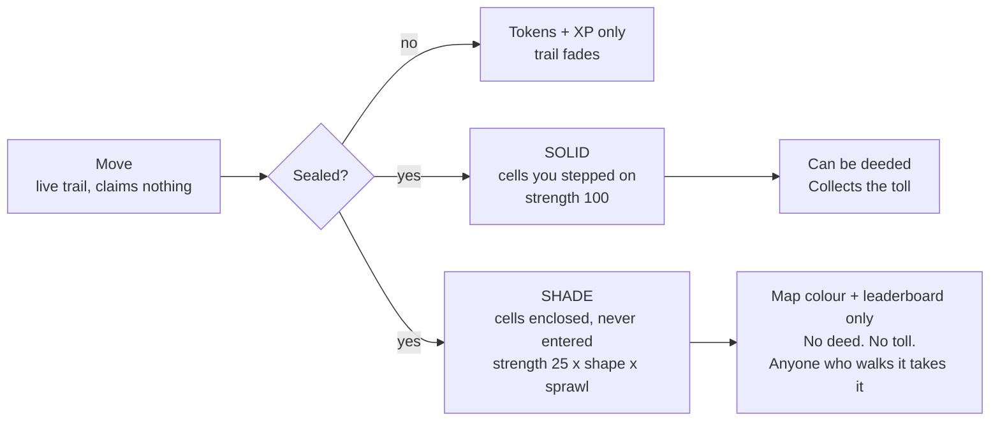

# MovenRun — Game Economy V3

**Status:** design, decided. Supersedes the 31 Aug "Game Economy & Tokenomics v2" PDF,
the 27 Aug master design, and `docs/TOKENOMICS.md` (which documents the *deployed
Sepolia v1 contracts*, a different and older economy).

**Date:** 31 August 2026 · **Chain:** Base · **Token:** one token, `$MOVE`

**Revision 2** adds the three things asked for after the first draft: the **daily recharge**
(one recurring bill, 50% of Charge per scoring session, paid out of that day's reward — §6.1),
a **five-level tree for land and a five-level tree for the Kit** (§6.2–6.3), and **eleven new
gamification mechanics, none of which issues a token** (§8).

> This is intended design for a development-stage product. It is not financial,
> investment, legal or tax advice, not an offer, and not a promise of returns.
> `$MOVE` does not trade: no sale, no listing, no liquidity, no allocation.
> Zone deeds are in-game digital assets and confer no real-world property rights.
> Every number marked *hypothesis* is a modelled starting point to be replaced by
> measurement in the pilot.

---

## 0. Review of the v2 proposal — what survives, what changes

The v2 document is the best of the six. Its economic spine is correct and I keep it:
one source of issuance, a fixed capped pool, land paid out of a runner's own reward,
nothing purchasable that earns, locked rewards for free players, a real burn, and a
limits register. Two of its numbers even reconcile properly when you check them —
9M decaying 10% a season to a 2M floor really does sum to 400M over ~180 seasons
(~44 years), which is the gap the 25 Aug brief flagged against itself.

Where v2 is wrong, incomplete, or conflicts with what you have now asked for:

| # | v2 said | V3 rules | Why |
|---|---|---|---|
| R1 | Zones you cross are claimed outright; closing a loop *also* claims the interior | **Nothing is claimed until the route is sealed.** No seal, no colour | You asked for it, and it is the single biggest gamification win available. It turns every session into a hand of cards you have to get home to bank |
| R2 | Enclosed interior claimed "at reduced strength" (unspecified) | **Shade**: a named, weaker state with exact numbers, which anyone can overwrite by physically walking it, and which can never be deeded or collect a toll | Makes "one person runs the ring road, another wins the streets inside" a real rule instead of a hope. Also closes the exploit where one bike lap around a city collects toll from the whole city |
| R3 | Toll split "by share of your reward-bearing route" | **Split by deeded cells crossed per owner.** 4 owners crossed equally → 0.5% each; 8 → 0.25% each | Your rule. It is also simpler to explain and cannot be gamed by GPS sampling rate |
| R4 | *No* cap on player earnings; only "2 scoring sessions/day" and a share-of-pool | **Hard `C_session` and `C_day` ceilings** on top of the share-of-pool | You asked for both, and you are right: pro-rata alone is unbounded per account when the population is small. §9 shows exactly which constraint binds when |
| R5 | Distance has **zero** effect on tokens | Distance has a **concave, saturating** effect inside one session, under a hard ceiling | v2 over-corrected. Telling a runner their extra 30 km is worth literally nothing is a bad product. The farming incentive v2 feared is killed by the ceiling, not by flattening the curve — see §9.2. **This is a change from your v2 ruling; flagged for your sign-off.** |
| R6 | Rewards settle "per period", period undefined | **One settlement per city per day, at day close**, pro-rata across everyone who actually ran that day | Your rule, and it makes the pool visible and social ("2,300 runners out today") |
| R7 | Upkeep charged absentees, mechanism unspecified | **Skip penalty**, auto-debited from the day's reward at settlement, priced off the 4th-root holdings curve | Your rule. Also gives the penalty a source of funds that cannot fail |
| R8 | Gear/repair sinks, plus "no engineered shortfall" | Kept, and made enforceable: **no sink may cost more than the reward that created the need for it** | v2 asserted the principle but gave no rule that stops a future designer breaking it |
| R9 | Wallets "created for you"; embedded wallets "not built" | Auto-provisioned smart account at signup + a **paymaster policy with six named controls** (§13) | The Base Readiness Audit is blunt: zero hits for `paymaster`, `4337`, `bundler` or `gasless` anywhere in the codebase. This is the largest unbuilt dependency in the design |
| R10 | Free players' locked balance stakeable for liquid yield | Kept, but **staking is deferred to Phase 4** and is not part of the launch economy | The integrity review's advice ("prefer no token yield at launch") is right. A yield product on day one is the fastest route to being read as a security |

**What I did not change, and you should resist changing later:** the 1B cap, the
2.00% toll ceiling, "nothing you buy ever earns", the no-retroactive-unlock rule,
`ownerTollMinted == 0`, and never publishing a cell path on-chain. Those five are
load-bearing. Everything else in this document is tuneable.

**The one honest risk in what you have asked for** is R-liquid (§11.3): making all
earnings liquid from the moment someone acquires land is, read plainly, "do a thing,
and your rewards become sellable". The guardrails are that land is *earned through
verified traffic over time and cannot be bought with cash*, and that liquid issuance
is separately capped by real business revenue. That is defensible. It still needs
counsel sign-off per market before Phase 3, and I would not launch it before then.

---

## 1. The twelve rules that never change

1. **Only verified movement creates `$MOVE`.** Not land, not staking, not spending, not referrals.
2. **There will never be more than 1,000,000,000.** No function can raise it.
3. **Nothing is claimed until you seal it.** Get back to where you started, to ground you already own, or cross your own trail.
4. **The toll is 2.00% of a session, once, total** — divided among every deed you crossed, however many there are.
5. **Land pays out of a runner's reward, never out of new supply.** `ownerTollMinted == 0`, checked every settlement.
6. **There is a ceiling on one session and a ceiling on one day**, and the day's ceiling is smaller than two sessions' worth.
7. **Rewards settle once a day**, shared out among the people who actually moved that day.
8. **Nothing you buy earns you anything.** Purchases buy defence, durability, identity and tools.
9. **There is one recurring bill: the daily recharge**, and it is always a share of what you earned that day — never a flat price, never payable with cash.
10. **No sink may cost more than the reward that created the need for it.** Every core loop completes without ever topping up.
11. **Free players' rewards are never sellable, and never become sellable retroactively.**
12. **Your route never goes on-chain.** Not raw GPS, not cell lists, not ever.

---

# PART ONE — THE GAME

## 2. A session

Tap start, move within two seconds. No wallet prompt, no chain jargon, no setup. Walk,
run or cycle; cycling is scored on its own map so a bike cannot out-cover a walker.

While you move, your route draws behind you as a **live trail**. The trail is not yours
yet. It is a bet.

**Qualification** (a session must clear this to score at all): ≥ 10 minutes and ≥ 750 m
of verified movement, with published accessibility alternatives. Below that it is a walk,
not a play.

**Verification** decides whether a session exists economically at all: speed plausibility,
GPS accuracy, continuity, sensor/GPS agreement, mode classification (walk vs run vs cycle
vs vehicle) from cadence, acceleration, stop pattern and altitude, and map plausibility.
A passing session becomes a signed, compact proof. The proof settles; the route does not.

Stated honestly: no location system is spoof-proof. The goal is that cheating costs more
than playing — see §16.

## 3. Sealing — the rule that makes it a game

**A route claims nothing until it is sealed.** Three ways to seal, and you can use any of them:

| Seal | Rule | Feel |
|---|---|---|
| **Come home** | Finish within **150 m** of where you started | The classic loop |
| **Come to ground** | Finish on any cell you already hold or hold a deed to | Ownership pays for itself — your land is a safe harbour |
| **Cut your own line** | Cross your own live trail; the enclosed sub-loop seals immediately, and you keep running | The `paper.io` moment. Big, chunky, and free |

**An unsealed run still earns full tokens, full XP, materials and streak.** It only fails
to claim ground. This matters: nobody is ever stranded, rushed, or unsafe because they
need to close a loop to get paid. Land is the thing you play well for; tokens are the
thing you show up for.

**Optional, Phase 3, simulate before shipping:** if another player crosses your live trail
before you seal it, your unsealed trail is cut and the portion behind the cut is lost. It
is the best PvP mechanic available and costs the token supply nothing. It is also the most
grief-prone thing in this document, so it does not ship until it has been simulated against
a coordinated club.

## 4. Claiming — solid ground and shade

Sealing produces two very different kinds of territory. This is the answer to
*"someone can run and control a whole city, but another person can win the area inside."*



| | **Solid** | **Shade** |
|---|---|---|
| What it is | Cells you physically moved through | Cells enclosed by your sealed loop, never entered |
| Claim strength | **100** | **25 × shape × sprawl** (below) |
| Decays | At the base rate | **3× faster** |
| Can become a deed | Yes | **Never** |
| Collects the toll | Yes (once deeded) | **Never** |
| Counts for map colour, area held, leaderboards, district control | Yes | Yes |
| How someone takes it | Erosion (§5) or a formal contest if deeded | **Anyone who physically walks it takes it instantly, at strength 100** |

**shape** = the isoperimetric quotient `4π·Area / Perimeter²`, capped at 1. A circular
loop scores ~1. A long thin sliver scores near 0.

**sprawl** = `min(1, 12 × solidCells / shadedCells)`. Enclose up to 12 cells for every
cell you stepped on at full shade strength; beyond that, shade thins out proportionally.

**What this buys you.** Run the whole ring road of a city and you get the city — in
outline, in colour, on the leaderboard, with an achievement for it. Your shade over the
centre will be worth a handful of strength points and will drain in days. Meanwhile the
person who actually walks the high street takes those cells at full strength, keeps them,
and is the one who can eventually deed them and collect the toll. **Shade is map control.
Solid is economy.** Both are real; only one pays.

**Never claimable at any strength:** military sites, schools, hospitals, shelters, private
land, and known hazards are masked out of the grid entirely.

## 5. Holding — condition, erosion and the skip penalty

Every held cell has a **strength**, 0–100, and exactly one holder.

- **Erosion.** Crossing a cell someone else holds subtracts your push from their strength:
  100 for solid, the shade value for shade. At zero it flips to you, carrying the overflow.
  Fortification (§6) reduces incoming push by up to 30%.
- **Deeded cells never erode.** They move only through a formal contest (§7). You still
  pay the toll to cross them.
- **Decay.** Strength drains daily from the last time you were there. Held → *at risk* →
  *contested* → *dormant* → back to the map, each stage shown in advance on a calendar.
- **Visiting is free and instant.** Walk your own ground and it resets to 100. Defence and
  exercise are the same action — that is the whole health thesis in one line.

**The skip penalty.** If you do not visit, you may pay to hold. It is charged where it cannot
fail: **auto-debited from your own reward at end-of-day settlement**, before anything reaches
your balance.

### The day-share — how every price in the game is quoted

One idea makes the whole economy immune to the network growing, and it is worth understanding
before the numbers below.

> **A day-share is what the median active player earned that day.** It is computed at
> settlement and published. Every price in MovenRun — upkeep, recharge, land levels, kit
> levels, claim fees, contest entry — is set in day-shares, and the app shows you the figure
> in tokens.

A flat token price cannot survive growth. Season 1 with 3,000 players pays near the ceiling of
20 a day; the same game with 100,000 players pays about 1 (§9.3). A 4-token fee is a fifth of
a day at the start and four whole days later on. Priced in day-shares, **the same thing costs
the same effort for ever**, at any population, at any token price.

### What upkeep costs

```
upkeepOwed(day) = 0.03 day-shares × zonesHeld^0.25   per zone you did not visit
```

| Zones held | Per zone / day | All unvisited: per day | Per week |
|---|---|---|---|
| 1 | 0.030 day-shares | 0.03 | 0.2 |
| 6 | 0.047 | 0.28 | 2.0 |
| **16** | 0.060 | **1.00 — one full day's earning** | 7.0 |
| 30 | 0.070 | 2.11 | 14.8 |
| 100 | 0.095 | 9.49 | 66 |
| 250 | 0.119 | 29.8 | 209 |

**About sixteen zones is what movement income alone sustains if you never visit any of them.**
Visit them and the number is unlimited, because visiting is free. Own busy ground and the toll
pays your upkeep for you — which is the design working exactly as intended: *land that people
actually cross pays for itself; land you hoarded and abandoned does not.*

At 250 zones the bill is thirty days of earning, every day. You may own a whole city. You
simply cannot keep it. **The anti-whale limit emerges from the game rather than being an
arbitrary rule bolted on top**, everything spent is burned, and a committed local with six good
zones never feels it.

### You are never asked for more than you have

Upkeep is *owed* per zone, but what is *taken* is bounded. At settlement the system pays what
it can from the day's reward, up to the combined 60% ceiling on all automatic debits (§6.1).
Anything still unpaid is **paid in condition instead**: those zones decay that day as though
nothing had been paid on them.

So the sequence for someone holding more than they can afford is: pay what today's run covers,
lose condition on the rest, watch the stages arrive on the calendar — *at risk*, *contested*,
*dormant* — and either go and walk them, or let them go back to the map. **You never go into
debt, your balance never goes negative, and no zone is ever lost without warning.**

**Free grace, always:** 14 days of away protection per season, free, announced in advance, one
tap. You never pay to protect what you earned; you pay only to be absent beyond that.

## 6. Charge, the daily recharge, and levels

### 6.1 Charge — the one bill in the game

Your Kit holds **100% Charge**. Every session that *earns tokens* burns **50%**. You get two
scoring sessions a day (§9.2), so a full day of play costs exactly one full charge. That is
not a coincidence — it is what turns the two-session cap from an arbitrary rule into a
resource you can see and plan around.

**Once a day, at settlement, your Kit refills and the bill is taken out of that day's reward.**
It is the only recurring expense in the game, and it is always affordable, because it is
priced as a share of what you actually earned:

```
recharge(day) = chargeUsed(day) × recharge%(kit level) × grossReward(day)

              100% used at Kit L1  →  25% of the day's gross
               50% used at Kit L1  →  12.5%
                0% used            →  nothing
```

| You ran | Charge used | Kit L1 pays | Kit L5 pays |
|---|---|---|---|
| Nothing | 0% | **0** | **0** |
| One scoring session | 50% | 12.5% of the day's gross | 7.5% |
| Two scoring sessions | 100% | 25% of the day's gross | 15% |

**Why a percentage and not a flat number.** You asked for "a certain amount of token", and
that is exactly what the player sees — the app shows the exact figure before you go out
("Today's recharge: 3.40 $MOVE") and again on the receipt. Behind that figure it is a
percentage, because a flat price cannot survive the network growing. At 100,000 daily
players the average day pays about 1 $MOVE (§9.3); a flat 4-token recharge would quietly
become a 400% tax. A percentage is the same felt cost at every scale, for ever.

**Four rules that keep this from becoming the thing that killed the last generation:**

| Rule | Why |
|---|---|
| **Charge is spent on credit and settled at day close** — earn first, then the bill | There is no state where you are too poor to recharge and therefore too uncharged to earn. The deadlock cannot happen |
| **Running with an empty Kit is always allowed** | You get territory, XP, streak, materials, contracts — everything except tokens for that session. It also costs no charge. **Charge gates minting, never play, and never your land** |
| **There is no cash top-up. Ever** | Recharge is paid in `$MOVE`, from your own earned balance, and there is no button that turns money into charge. That button is what made those games predatory |
| **All automatic day-close debits together are capped at 60% of the day's gross** | Recharge plus skip penalty can never take more than that, and can never push a balance negative. Beyond the cap, land condition degrades instead |

**Charge as a decision, not a chore.** You can mark any session *unscored* before you start.
It costs no charge, earns no tokens, and still takes ground and feeds your streak. So the
short morning dog-walk can be free and both charges saved for the evening loop you actually
care about — or spent early on a route you want to bank before someone else runs it.

**What the recharge does to the economy.** At full participation this burns roughly a quarter
of everything issued, every day, automatically. It scales with issuance rather than against
it, and unlike every other sink it needs no player decision to fire. It is the largest and
most reliable sink in the design.

### 6.2 Land levels — upgrade what you hold

Every zone you hold has a level. Upgrading costs `$MOVE` (burned) plus time you have actually
spent there. **Levels buy defence, capacity, identity and tools. Levels never buy income and
never buy a contest.**

| Lv | Name | Cost | Also requires | Decay resist | Erosion resist | Upkeep | Away | Forts | Unlocks |
|---|---|---|---|---|---|---|---|---|---|
| 1 | **Outpost** | — | claiming it | — | — | 1.00× | — | 1 | Name your zone |
| 2 | **Camp** | 2 day-shares | 3 visits in 14 days | +8% | +5% | 1.00× | +2 | 1 | Banner, colour, zone photo |
| 3 | **Holding** | 6 | 14 days held | +16% | +12% | 0.95× | +4 | 2 | **Rally beacon**, +10% materials, zone chat |
| 4 | **Stronghold** | 18 | 30 days held, deeded | +24% | +20% | 0.90× | +7 | 3 | Sponsor tools, footfall analytics, leasing |
| 5 | **Citadel** | 45 | 90 days held, survived a contest | +30% | +28% | 0.85× | +10 | 3 + 1 permanent | Landmark status, city-map icon, district vote weight |

**The caps that keep levels honest:**

- **Total decay resistance from level + fortification: +50% maximum.** Level 5 with three
  fortifications would be +60% raw; it is capped. Land that survives a fortnight away is the
  product. Land that survives for ever is not.
- **Total erosion resistance: +40% maximum.** A Citadel is hard to walk through. It is never
  impossible.
- **Contest contribution from level: exactly zero.** The +15% ceiling on what money can add to
  a contest score is *fortification only*. Levels add nothing to it. The pay-to-win line stays
  precisely where §7 draws it, and no amount of upgrading moves it.
- **Toll income at every level: 1.00×.** A Citadel on a dead-end street earns less than an
  Outpost on the high street, for ever. **Location is the only thing that makes land valuable.**
- **Lose the zone and it drops two levels.** Reclaim it within 14 days and it is restored in
  full, with a Reconquest badge. That is the stake that makes an upgrade a decision instead of
  a treadmill.

### 6.3 Kit levels — upgrade what you carry

The Kit is the player-side tree, and what it buys is a permanent reduction in your only
recurring cost.

| Lv | Name | Cost | Recharge | Also gives |
|---|---|---|---|---|
| 1 | **Starter** | — | 25% | — |
| 2 | **Broken-in** | 3 day-shares | 23% | +10% materials |
| 3 | **Trail** | 9 | 21% | Unused charge carries to tomorrow, up to 50% |
| 4 | **Distance** | 22 | 18% | −1 day on every cooldown; full route planner |
| 5 | **Veteran** | 50 | 15% | Ghost replays, +2 away days, veteran mark on the map |

Kit level never raises charge capacity — a third scoring session is not for sale at any price.
Kit level never touches token earnings, territory strength, or a contest.

*All upgrade prices are calibration hypotheses, quoted in day-shares (§5) so they cost the
same effort at any population. Fully levelling one zone is about 71 days of earning; fully
levelling the Kit is about 84. These are long arcs on purpose — and every coin is burned.*

### 6.4 Fortifying

Fortification is the short-term, expiring layer on top of a level: +30% decay resistance and
−30% incoming erosion while it lasts, up to 3 active at once, burned whether you win or lose.
In a formal contest it contributes **at most +15%**, and that is the whole of what money can
do to a contest.

The integrity review wanted that at zero. It stays at 15% because protecting your land is a
mechanic players understand and a real sink — **and it must be simulated against solo,
small-club and large-club attackers before launch. If the simulation shows it decides
contests, it goes to zero.**

## 7. Deeds and contests

A deed is permanent, transferable, and immune to erosion. **You cannot buy one.**

| Requirement | Hypothesis |
|---|---|
| Tenure | You have held the cell 21 consecutive days |
| Diverse organic traffic | ≥ 30 distinct verified people, across ≥ 10 different days |
| Concentration limit | No related-account cluster > 20% of that traffic |
| Your own traffic | Never counts. Nor does any account linked to you |
| Solid only | Shade can never be deeded |
| Account trust | Verified, non-duplicate |
| Per-city cap | No person or club may hold more than a published share of one city's deeds |
| Claim fee | `50 × sqrt(weekly distinct crossers)`, **burned**. Buys permanence, never income |

**A contest** is how a deed changes hands: 72 hours' notice, then a 7-day window in which
your best 3 days count. Entry fee burned. Score = verified movement + capped club support
+ 5–10% home advantage + fortification (max +15%). Nothing else is in the formula. Escrow
holds the deed; anyone can trigger settlement; the loser cannot stall. Beaten attacker
locked out of that deed 30 days; survivor gets 14 days of peace.

## 8. The gamification layer — none of it issues a token

This is the "maximum gamification, but easy" half. **Not one item below creates a single
`$MOVE`.** Everything here either costs nothing, moves tokens sideways between players, or
burns them.

### 8.1 The eleven mechanics

| # | Mechanic | How it works | Why it earns its place |
|---|---|---|---|
| 1 | **The seal** | Your trail is a bet until you close it (§3) | The core tension. Present in every session, free, and it is the whole game in one rule |
| 2 | **Charge tactics** | Two charges a day. Mark a session *unscored* to save one (§6.1) | Turns a cap into a decision. The morning walk becomes free; the evening loop becomes a choice |
| 3 | **Rally beacon** | Land L3+. Light your zone for 24h and anyone who crosses gets a contract tick and a materials bonus. Costs `$MOVE`, burned | **The only legitimate way to raise your toll income is to make people want to run there.** Perfect incentive alignment: landowners become promoters of their own neighbourhood |
| 4 | **Bounties** | Pin your own `$MOVE` to any zone — "first three verified crossers this week split it." Disclosed, skill-based, player-funded | Players author their own missions. Zero issuance; tokens move sideways. It makes a quiet suburb interesting for a week |
| 5 | **The Pincer** | Two players moving at the same time in the same city can seal the area *between* their two trails and split it | Physically social. The best reason to bring a friend, and it costs the supply nothing |
| 6 | **Ghost of the holder** | Kit L5. Entering a contested zone, you race the previous holder's route as a ghost | Turns an abstract contest into a head-to-head you can feel |
| 7 | **Streak shields** | Earned by hitting your own weekly goal. Spend one to protect a missed day. **Never purchasable** | Removes streak anxiety without removing streaks — and being un-buyable is what keeps it honest |
| 8 | **The Atlas** | A permanent, non-tradable record of every district you have ever sealed: date, shape of the loop, who held it before you | Pure status, and genuinely beautiful. The thing a five-year player has that a new one cannot buy |
| 9 | **Season pass — free track only** | 90-day objective ladder paying cosmetics, materials, shields and upgrade discounts. **There is no paid track** | All of the structure, none of the shakedown |
| 10 | **Reconquest** | Retake a lost zone within 14 days and its level is restored in full, plus a badge | Losing becomes a story instead of a wall |
| 11 | **Terrain and time** | Hills, parks, waterfront, night and rain change the *materials* drop table — never the token reward | Real reasons to vary your route, with zero effect on issuance |

### 8.2 The rest of the loop

**Every day** — three contracts (seal a loop over 1 km², cross two deeds, reconquer a lost
cell); the **live pool ticker** showing today's pool, runners out right now and your projected
share; and the city map redrawn at settlement, which is the daily who-took-what moment.

**Every week** — you set your own goal of 2 to 7 active days and hitting *your* target pays a
bonus; crew missions; club-versus-club district pushes.

**Every season (90 days)** — district and city wars; leaderboards layered block, suburb, city,
country and world so nearly everyone competes somewhere they can actually win; permanent
non-tradable badges (*City Outline*, *Reconquest*, *District Mastery*, *Cartographer* for the
largest sealed loop of the season); landmark cells auctioned with district vote weight
attached.

**Always** — gear crafted from terrain-gated materials, colours, map themes, banners, titles
and share cards. Pure sink, zero advantage.

### 8.3 Deliberately not shipping

**Area-weighted prize draws.** Every km² held being an entry in a monthly draw rewards players
without printing anything, which is attractive — but a chance-based reward tied to holdings is
a gambling-shaped mechanic with real app-store and legal exposure. Fixed, published sponsor
rewards instead. If any draw mechanic ever ships it must be detached from any payment, publish
its odds, and clear legal review in each market first.

**A paid season track, a cash charge top-up, and any purchasable streak protection.** These
are the three levers that turn a fitness game into a shakedown, and none of them is worth what
it earns.

# PART TWO — THE MONEY

## 9. Earning — three ceilings, one pool

### 9.1 The pool

| | |
|---|---|
| Supply cap | **1,000,000,000** `$MOVE`, in the contract, no function to raise it |
| Player rewards | **40% = 400M**, the only pool verified movement draws from |
| Season | 90 days. Season 1 releases **9M**; each season −10%, to a permanent **2M floor** |
| Runway | 400M over ~180 seasons ≈ **44 years**. Schedule is generated from the allocation, so they cannot drift |
| **Daily pool, season 1** | **100,000 `$MOVE`/day** — the only tap in the system |

Burned tokens are destroyed permanently and never restore room to issue more.

### 9.2 The activity score

```
effort(s)      = clamp(sqrt(qualifiedMinutes / 40), 0.5, 1.0)   # concave, saturates at 40 min
points(s)      = effort(s) × trustWeight(player)
dayPoints(p)   = ( sum of points over the day's 2 highest-scoring qualified sessions )
                 × consistency(activeDaysThisWeek)
```

| Component | Rule | Reason |
|---|---|---|
| Qualified session | ≥ 10 min, ≥ 750 m | Below this it does not score |
| Effort curve | `sqrt`, floor 0.5, saturates at 40 min | A 10-min walk scores 0.5; a 40-min run scores 1.0; a 3-hour run also scores 1.0. Real effort counts, endless effort does not |
| Sessions per day | Max **2** score | A morning and an evening walk. A third feeds the map, XP and streak only |
| Consistency | ×1.00 → **×1.50** at 6 active days | The largest single lever in the formula. A seventh day earns no more — rest is never punished |
| Distance | Feeds territory, materials, XP, personal bests. Inside the effort curve only, and capped | Endless-distance farming is dead because the ceiling is |
| Trust weight | 0 → 1. New, unverified, or high-risk accounts score at reduced weight; the difference stays in the pool | The one real defence against sybils; see §9.5 |

Two 25-minute walks a day, six days a week ≈ `2 × 0.79 × 1.5 = 2.37` day-points.
One 3-hour run once a week = `1.0 × 1.0 = 1.0`. Consistency wins by a factor of two,
which is the health outcome we want — but the runner is not told their run was worth zero.

### 9.3 End-of-day settlement

At day close, one settlement per city, all on the same globally published rate:

```
r(D)              = dailyPool(D) / Σ dayPoints(all players, all cities)
provisional(p)    = r(D) × dayPoints(p)
gross(s)          = min( provisional(p) × points(s)/dayPoints(p), C_session )
gross(p)          = min( Σ gross(s), C_day )
clipped           = Σ (provisional − gross)   →  returns to the season pool

then, in this exact order, from gross(p):
  1. toll debit          §10   0–2% of each session
  2. daily recharge      §6.1  chargeUsed × recharge% × gross
  3. skip penalty        §5    only on zones you did not visit
  4. any bounty you pinned or upgrade you queued
  → net credited to the player

  steps 2–4 combined can never exceed 60% of gross, and can never make a balance
  negative. Past the cap, land condition degrades instead of the player going into debt.
```

| Ceiling | Value (hypothesis) | Job |
|---|---|---|
| `C_session` | **12 `$MOVE`** | No single session can max out a day. Forces two-a-day, which is the health goal |
| `C_day` | **20 `$MOVE`** | Your hard per-account daily cap. `C_session / C_day = 0.6` is a fixed ratio, not a coincidence |
| Daily pool | **100,000/day** | The system-wide cap. Absolute, always |

**Which ceiling actually binds, and when — this is the part worth understanding.**

- Below ~**5,000 daily active players**, the pro-rata share would exceed `C_day`, so the
  **ceilings bind** and the surplus rolls back into the season pool. This is the pilot regime,
  and it is why you were right to want caps: pro-rata alone would have paid the first 100
  players 1,000 `$MOVE` a day each.
- Above ~5,000 DAU, the share falls below the ceiling and the **pool binds**. At 100,000 DAU
  the average day pays ~1 `$MOVE`. That is intended and must be said out loud: per-session
  token income shrinks as the network grows. The game has to be worth playing for the map,
  and the durable value has to come from land, not from the drip.
- **Clipped surplus never goes to other players that day.** It returns to the season pool and
  spreads across the season's remaining days. It never crosses a season boundary, and it can
  never raise the 400M allocation.

### 9.4 Settlement mechanics

Everything accrues off-chain during the day. At close, per city: one Merkle root, one
transaction. Players pull-claim; a claim is one sponsored transaction, not one per action.
That is ~5,050 transactions a day at 100k players instead of 500,000 — roughly a 100× cost
difference, and we pay the gas.

The off-chain ledger **cannot create `$MOVE`**. Only `SettlementRoot` can, only against the
day's budget, only from an authorised, expiring, chain-bound signature. Every input to the
day's calculation is published in aggregate, the algorithm is deterministic and versioned,
and any player can verify their own inclusion with a Merkle proof against the published root.
A reconciliation job recomputes the root independently and **halts settlement** if the books
do not balance.

### 9.5 Why pro-rata makes sybils *more* attractive, and what actually stops them

Say it plainly, because v2 did not: a shared pool means 1,000 fake accounts take 1,000
shares out of `N + 1,000`. Pro-rata makes farming *more* profitable, not less, and a
per-account cap does nothing about it — each fake account simply earns up to its own cap.

Three things actually stop it, and none of them is the cap:

1. **Fake accounts earn locked tokens.** Locked can never be sold, and never becomes
   sellable retroactively (§11.2). A farm of 1,000 accounts holds a pile of `$MOVE` that
   can only be spent on upkeep for land those accounts do not have. *An account that costs
   nothing to make is worth nothing to farm.* This is the protection.
2. **Trust weight.** A new or unverified account scores at reduced weight until it has
   verification history — passkeys, device history, and a risk graph over shared devices and
   synchronised routes. Weight withheld stays in the pool; it is not redistributed to whales.
3. **Every account must physically move**, in a real place, for real minutes, under sensor
   fusion and mode classification, to score at all.

## 10. The toll — how land earns

Cross ground someone holds a **deed** to and **2.00% of that session's reward** goes to
deed holders. Not 2% per owner. 2% for the session, however many you crossed.

```
q(s)      = foreignDeededCellsCrossed / totalRewardBearingCellsCrossed
T(s)      = floor( gross(s) × 0.02 × q(s) )                  # 0 ≤ T ≤ 2% of gross, always
P(s,o)    = T(s) × cellsCrossedOwnedBy(o) / foreignDeededCellsCrossed
```

| Your session | You earn | Toll | You keep | Owners' share |
|---|---|---|---|---|
| No deeded ground on the route | 20.00 | 0.00% | 20.00 | 0.00 |
| 4 of 6 cells deeded | 20.00 | 1.33% | 19.73 | 0.27 |
| Every cell deeded, **4 owners equally** | 20.00 | **2.00%** | 19.60 | **0.10 each = 0.50% each** |
| Every cell deeded, **8 owners equally** | 20.00 | **2.00%** | 19.60 | 0.05 each = 0.25% each |
| Every cell deeded, 20 owners | 20.00 | **2.00%** | 19.60 | 2% split twenty ways |

Your rule exactly: the more land you cross, the more finely the same 2% divides. Crossing
twenty owners costs identically to crossing one.

**Rules on top of the formula:**
- Your own land is free to cross, and so is any account linked to you. You cannot pay yourself.
- Repeated laps over the same cell in one session count **once**. Ten circuits pay one toll.
- Rounding remainders return **to the runner**, so the system never takes more than disclosed.
- **Shade never collects a toll.** Only deeded solid ground does.
- Tier, level, fortification and spending have **no effect** on toll income. Location does.

**No cap on an individual owner, and still a hard system limit.** If 100,000 real verified
people cross your high street, you collect from 100,000 real sessions — genuine traffic is
never punished. And because the toll is a slice of a fixed pool, the total paid to every
landowner on Earth in season 1 cannot exceed **2% × 9M = 180,000 `$MOVE`**. Both statements
are true simultaneously, and that is the whole design.

**Nothing is created.** Every coin an owner receives was subtracted from a runner in the
same transaction. `ownerTollMinted == 0`, asserted every settlement.

## 11. One token, two states

### 11.1 The states

| | **Locked** | **Liquid** |
|---|---|---|
| Buys everything in the game | Yes | Yes |
| Transfer / sell / withdraw | **No, ever** | Yes |
| Voting rights | No | Yes |
| Buys and sells deeds on the market | No | Yes |

One balance in the app, one number, one token, one supply cap. Only transfer permission differs.

| How you got it | State |
|---|---|
| Reward for a session, as a free player | **Locked** |
| Reward for a session, as a deed holder (after they hold a deed) | **Liquid** |
| Toll paid to you by someone crossing your deed | **Liquid** |
| Sponsor prize | **Liquid** — the sponsor deposited existing tokens |
| Bought on the market | **Liquid** |

### 11.2 The no-retroactive-unlock rule

**When a free player acquires their first deed, everything they earned before that moment
stays locked for ever.** Only rewards earned *after* they qualify are liquid.

This single rule closes the loophole that would otherwise sink the design: farm for months
across free accounts, qualify one of them, cash out everything. It is not negotiable and it
must be enforced in the token contract, not in the backend.

### 11.3 Land as the liquidity gate — your rule, and its one risk

You asked that all earnings become liquid from the moment someone acquires land, and that
is what §11.1 does. Three guardrails make it defensible rather than reckless:

1. **Land cannot be bought with money.** Deed eligibility is 21 days' tenure, 30 distinct
   verified crossers over 10 days, and a concentration limit (§7). The claim fee is a small
   burn, not a purchase — you can burn a million tokens and still not qualify.
2. **The revenue valve.** Total *liquid* issuance in a period is capped at what the business
   actually earned — sponsorships, subscriptions, events, marketplace fees. If liquid demand
   exceeds that budget, the excess **mints locked**, and the shortfall is published. Sellable
   supply can never outrun real revenue.
3. **The daily pool is still the ceiling.** Liquid is a *state* of an already-capped issuance,
   not a second stream.

The residual risk is presentational and legal, not economic: "acquire land and your rewards
become sellable" reads adjacent to an investment gate, which is precisely the framing the
30 Aug review told you to remove. I have kept it because you asked and because the three
guardrails above are real, but **it needs per-market counsel sign-off before Phase 3.** If
counsel objects, the fallback is one line: deed holders' rewards stay locked, and staking
yield (§14) becomes the only route to liquid. Design that fallback in now so it is a config
flag, not a rewrite.

## 12. Sinks and revenue

**Sinks — every one of them burns, and not one of them earns.**

| Sink | Frequency | Notes |
|---|---|---|
| **Daily recharge** | Every day you played | **The largest sink in the design.** 25% of the day's gross at Kit L1, 15% at L5, pro-rated to the charge you used, auto-debited at settlement (§6.1). Scales with issuance, needs no player decision, and burns roughly a quarter of everything created |
| **Skip penalty / upkeep** | Daily | The volume sink for landholders. Free if you visit instead — it only ever charges absentees. Scales with holdings (§5) |
| **Land levels** | Rare, large | 2 → 45 day-shares per zone, burned. Buys defence, capacity, identity and tools; never income, never a contest (§6.2) |
| **Kit levels** | Rare, large | 3 → 50 day-shares, burned. Buys a permanently cheaper recharge (§6.3) |
| **Rally beacons** | Weekly-ish | Burned. Buys traffic to your zone, which is the only honest way to raise toll income |
| **Fortify** | Weekly-ish | Burned whether you win or lose |
| **Deed claim fee** | Rare, large | Scales with how busy the ground is |
| **Contest entry** | Rare | Buys your place, never score |
| **Gear crafting** | Regular | Materials are terrain-gated; the burn is the token cost |
| **Cosmetics, identity, map themes** | Impulse | Pure sink, zero advantage |
| **Landmark auctions** | Seasonal | Rare city cells; proceeds burned |
| **Deed transfer fee** | On sale | A cut of marketplace activity, burned |
| **Season burn** | Quarterly | A **real** burn. The deployed v1 contract transfers to treasury and calls it a burn — that must be rebuilt |

**The rule that keeps the sinks honest:** *no sink may cost more than the reward that
created the need for it.* The recharge is a fixed share of the day's gross, and every
automatic day-close debit together is capped at 60% of it. Upkeep is debited from the day's
reward and cannot push a balance negative — it degrades your land instead. Every core loop
completes with zero purchases. If revenue ever depends on a gap we designed into
progression, we built the wrong business.

**Revenue — real money, three of the four independent of the token price**

| Engine | Predictability | Needs `$MOVE`? |
|---|---|---|
| Sponsors & brands — zone sponsorship, city campaigns, footfall analytics | Medium, contract-based | No |
| Subscriptions — premium, club and organiser tools | High, recurring | No |
| Events — races, city events, charity runs | Lumpy, high value | No |
| Land economy — claim fees, marketplace cut, leasing | Activity-driven | Partly |

**Never charged for:** playing, moving, capturing, streaks, clubs, city competition,
protecting what you earned, wallets, or network fees. Charging there would kill the density
everything else depends on.

If `$MOVE` were worth nothing tomorrow, three of these four engines are unchanged and the
game is still worth playing. That separation is the entire strategy, and it is what the
collapsed move-to-earn products did not have.

---

# PART THREE — HOW IT RUNS

## 13. Wallets and gas — auto-created, sponsored, and un-drainable

**At signup:** email or phone + passkey, then an **embedded smart account is provisioned
automatically** and idempotently (`docs/adr/0004-automatic-wallet-provisioning.md` already
specifies this). No seed phrase, no chain jargon, no wallet screen unless the player goes
looking. It is the account every transaction runs through.

**Gas is sponsored** through a Base paymaster. You asked that nobody be able to extract that
sponsorship for personal benefit. Six controls, all required together:

| # | Control | Stops |
|---|---|---|
| 1 | **Selector allowlist.** The paymaster sponsors only named functions on MovenRun contracts. Arbitrary calls, arbitrary targets, `approve`, and raw transfers are never sponsored | Using our gas budget to run someone else's transactions |
| 2 | **Play-gated authorisation.** A sponsored op needs a short-lived server signature bound to account, day, nonce and a *verified session*. No play, no sponsorship | Bot swarms that never move |
| 3 | **Zero for new accounts.** An account gets no sponsorship until its first verified session settles | Signup-farming the gas budget |
| 4 | **Per-account quotas.** N sponsored ops per account per day (hypothesis: 10) and a per-op gas ceiling | One account draining the day's budget |
| 5 | **Global daily budget + circuit breaker.** Sponsorship stops automatically at the cap and pages on-call | A bug or an attack costing an unbounded amount |
| 6 | **No refund path.** Sponsorship pays the bundler in ETH. It never credits a player's account, and no contract refunds gas to a user | Converting sponsored gas into value — there is nothing to extract |

**And the exit is never sponsored-only.** A player can always pay their own gas to transfer
or withdraw. If sponsorship is paused for any reason, withdrawals and transfers keep working
— a pause that can trap assets is indistinguishable from a rug pull.

## 14. Staking — deferred

Staking a locked balance for a liquid yield is a good long-term mechanic and is the fallback
if §11.3 does not survive legal review. It is funded from its own **10% (100M) allocation**,
1.25M per season, checkpointed so a rate change never re-prices a past period — a defect
proven in the deployed vault. **It does not ship before Phase 4.** A yield product at launch
is the fastest way to be read as a security, and the integrity review is right about this.
No rate, no APR, no payback period is ever quoted.

## 15. On-chain, off-chain, and the invariants

| | On-chain? | How |
|---|---|---|
| Session reward | **Yes** | Batched into the day's settlement; provable from the root |
| In-game spends (recharge, upkeep, levels, fortify, gear) | **Yes** | Same settlement, with a receipt naming what it paid for |
| Toll runner → owner | **Yes** | Matched debit and credit in one settlement; must sum to zero |
| Claiming what you're owed | **Yes** | One direct sponsored transaction per claim |
| Deed creation / transfer | **Yes, immediately** | Its own transaction. Ownership is never batched |
| Contest settlement | **Yes, immediately** | From escrow |
| XP, levels, streaks, badges, condition, materials | **No** | Game ledger. Gas for a number nobody trades is waste, it publishes an activity record, and an on-chain XP balance that gates earnings starts to look like an asset |
| Your route, cells, GPS | **Never** | A public sequence of map cells *is* a route |

**Contracts:** `MoveToken` (cap + both states, the only mint/burn), `SeasonController`
(daily budget from the season schedule), `DeedRegistry`, `SettlementRoot` (one authorised
settlement per city-day, pull claims), `ContestEscrow`, `BurnRouter` (a real burn, with a
public receipt), `PaymasterPolicy`, `Governor + Timelock`, `OracleVerifier` (may sign;
may never move anyone's money).

**Invariants a fuzz suite must prove over thousands of random sequences, not three fixed cases:**

1. `ownerTollMinted == 0`
2. `gross == runnerNet + Σ ownerCredits`, per session
3. `Σ tollDebits == Σ ownerCredits`, exactly
4. `0 ≤ tollDebit ≤ floor(0.02 × gross)`
5. `Σ dayGross ≤ dailyBudget`, and `Σ seasonGross ≤ seasonAllocation`
6. `gross(s) ≤ C_session` and `Σ gross(p, day) ≤ C_day`
6a. `recharge + upkeep + queued spends ≤ 0.60 × gross(p, day)`, and no balance can go negative
6b. Level and fortification together contribute `≤ +50%` decay resistance, `≤ +40%` erosion resistance, and `≤ +15%` to any contest score
7. One session settles once; one city-day finalises once
8. No path turns locked into liquid except: holding a deed at the time of earning, tolls, sponsor prizes
9. `liquidIssued(period) ≤ revenueValveBudget(period)`
10. With the system paused, a user can still transfer and withdraw
11. A replayed signature, wrong chain id, wrong contract address, or expired deadline all revert

## 16. Cheating, and why it does not pay

| Attack | Why it does not pay |
|---|---|
| Fake the GPS | Tamper checks, sensor data signed as recorded, must agree with the GPS trace and the map. One session, one use. Nothing mints without the verifier's signature |
| Drive it slowly | Mode classification from cadence, acceleration, stop pattern and altitude — not a speed threshold. A 79 km/h cut-off passes slow city driving; ours does not |
| Shake the phone | Steps without displacement earn nothing |
| Run 100 km for 100× the tokens | `C_session` and the saturating effort curve. The single largest farming incentive in every previous version is gone |
| Split one walk into ten sessions | Pauses inside a 30-minute window merge; a new session needs 10 min and 750 m of fresh movement; only 2 sessions a day score |
| Make a thousand accounts | They earn **locked** tokens that can never be sold, at reduced trust weight, and each must physically move. See §9.5 |
| Two accounts paying each other tolls | Creates zero tokens — it moves a slice of an already-fixed reward. The real risk is *faking how popular land looks*, so related traffic is excluded from deed eligibility metrics |
| Ring-road lap to toll a whole city | Shade collects no toll and can never be deeded (§4). This is the specific exploit shade exists to kill |
| Manufacture traffic to qualify land | 30 distinct verified people over 10 days, related accounts excluded, owner's own traffic never counts |
| Buy the map | Upkeep rises with holdings, per-city deed cap, tiers add zero income, everything spent is burned |
| Club sweeping every deed | One support budget per person per contest, diminishing, per-city limits |
| Grief one owner | 30-day attacker lockout, burned entry fee, 14 days of peace for the survivor |
| Drain the gas budget | Six controls in §13, and nothing to extract even if you get sponsored |
| Compromise the signing key | Hardware keys, separate key per job, short-lived signatures, rate bounds, rotation, and a circuit breaker that pauses **new settlement only** — never withdrawals |

**Anything that can be automated earns nothing sellable. Anything sellable requires being in
a real place, over real time.**

## 17. Location privacy

Nothing about an individual's path goes on-chain. Ever. The 27 Aug design published the list
of cells each session crossed on a permanent public ledger — raw GPS was correctly excluded,
but a public sequence of cells *is* a route, readable by anyone, for ever. That is fixed here.

| Data | Where | How long | Who |
|---|---|---|---|
| Raw GPS & sensors | Encrypted, short-lived | 24–72 h | Verification workers only |
| Fraud signals | Risk store, minimised | Reviewed | Fraud team, with an audit log |
| Your game route | Private game ledger | You choose | You, and who you authorise |
| Sponsor analytics | Aggregated, thresholded | Campaign term | No individual path, no re-identification |
| Public chain | Day totals and amounts only | Permanent | Everyone — so it contains no route |

Start and end areas blurred; public activity delayed; a private account earns exactly as much
as a public one. Consents for location, fraud checks, marketing, sponsor analytics and public
sharing are separate and revocable, and withdrawing is as easy as giving.

---

# PART FOUR — THE REGISTER AND THE PLAN

## 18. Every limit in one place

| What | Limit | Type |
|---|---|---|
| Total supply | 1,000,000,000 | Fixed |
| Player reward allocation | 400M over ~180 seasons | Fixed |
| Season pool | 9M, −10%/season, 2M floor | Fixed |
| **Daily pool, season 1** | **100,000 `$MOVE`** | Fixed |
| **Charge per scoring session** | 50% of 100 | Fixed |
| **Daily recharge price** | 25% of the day's gross at Kit L1, 15% at L5 | Hypothesis |
| **All automatic day-close debits** | ≤ 60% of the day's gross, combined | Fixed |
| **Cash top-up for charge** | Does not exist | Fixed |
| **Running with an empty Kit** | Always allowed; earns everything except tokens | Fixed |
| **Land levels** | 5, costing 2 → 45 day-shares, burned | Hypothesis |
| **Kit levels** | 5, costing 3 → 50 day-shares, burned | Hypothesis |
| **Decay resistance, level + fortify** | +50% combined maximum | Fixed |
| **Erosion resistance, level + fortify** | +40% combined maximum | Fixed |
| **Level contribution to a contest** | Zero. The +15% is fortification only | Fixed |
| **Level effect on toll income** | 1.00× at every level | Fixed |
| **Losing a zone** | Drops two levels; full restore if reclaimed in 14 days | Fixed |
| **Charge capacity** | Not purchasable at any price | Fixed |
| **Paid season track / purchasable streak shields** | Do not exist | Fixed |
| **Per-session ceiling `C_session`** | **12 `$MOVE`** | Hypothesis |
| **Per-day ceiling `C_day`** | **20 `$MOVE`** | Hypothesis |
| `C_session : C_day` ratio | 0.6 — one session can never max a day | Fixed |
| Clipped surplus | Returns to the season pool; never crosses a season | Fixed |
| Scoring sessions per day | 2 | Fixed |
| Consistency multiplier | ×1.50 at 6 active days; 7th earns nothing more | Fixed |
| Effort curve | `sqrt(min/40)`, floor 0.5, saturates at 40 min | Hypothesis |
| Minimum economic session | 10 min, 750 m | Hypothesis |
| Session merge window | 30 min | Hypothesis |
| Trust weight | 0–1; withheld weight stays in the pool | Hypothesis |
| **Toll rate** | **2.00% of a session, once, total** | Fixed, not governable |
| Toll split | By deeded cells crossed per owner | Fixed |
| Total toll to all owners, season 1 | 180,000 `$MOVE` | Structural |
| Owner daily income | **No cap** | Deliberate |
| Repeated laps | Toll once per cell per session | Fixed |
| Seal radius | 150 m, or own ground, or self-intersection | Hypothesis |
| Solid claim strength | 100 | Fixed |
| Shade claim strength | 25 × shape × sprawl | Hypothesis |
| Shade sprawl bound | 12 enclosed cells per stepped cell | Hypothesis |
| Shade decay | 3× solid | Hypothesis |
| Shade deed eligibility | **Never** | Fixed |
| Shade toll income | **Never** | Fixed |
| Deeded cells | Cannot erode; contest only | Fixed |
| Skip penalty | 0.03 day-shares × zones^0.25, per unvisited zone per day | Hypothesis |
| Unpayable upkeep | Paid in condition, never in debt. Balances never go negative | Fixed |
| All prices in the game | Quoted in day-shares, displayed in tokens | Fixed |
| Away protection | 14 days per season, free | Fixed |
| Repair cost | ≤ 15% of that session's reward | Fixed |
| Fortifications active | 3 per zone, each expires | Fixed |
| Fortify vs decay | +30% | Hypothesis |
| Fortify in a contest | +15% max | Fixed |
| Home advantage | 5–10% | Hypothesis |
| Club support | One budget per person per contest, diminishing | Fixed |
| Attacker cooldown / defender peace | 30 days / 14 days | Fixed |
| Deed tenure / traffic | 21 days / 30 distinct people over 10 days | Hypothesis |
| Deeds per person per city | Capped | Fixed |
| Tier effect on income | 1.00× at every tier | Fixed |
| Sponsored ops per account per day | 10, play-gated, allowlisted selectors | Hypothesis |
| Sponsorship for a new account | Zero until first verified session | Fixed |
| Liquid issuance | ≤ revenue valve budget | Fixed |
| Staking allocation | 100M total; deferred to Phase 4 | Fixed |
| Raw location retention | 24–72 h | Target |
| Route data on-chain | None, ever | Fixed |
| Governance over the toll or the cap | Impossible | Fixed |
| Pause scope | New claims and settlement only; never withdrawals | Fixed |

If a mechanic is not on this list, it does not ship.

## 19. What we promise not to do

- Make a rest day feel like a loss. Weekly goals you set, not daily streak punishment.
- Charge you to protect what you earned. Visiting is free; away protection is free.
- Sell a contest win. Money buys entry, durability and appearance; movement decides outcomes.
- Design a shortfall and sell you the fix. Every core loop completes without a purchase.
- Use fake urgency, loss-framed notifications, or confetti over a money figure.
- Pre-select a purchase or auto-top-up. Exact cost, exact benefit, shown before you commit.
- Promise income, payback, a rate or a price.
- Freeze your exit. We pause new claims — never withdrawals or transfers.
- Change the rules retroactively. Every session records the rules version it was played under.
- Quietly seize an account. Recovery has a visible delay and notifies every channel.

Notifications, public leaderboards, token-price display, social comparison and wallet export
are each independently switchable. Someone who wants a quiet walking app should be able to
have exactly that.

## 20. Where the code actually is

**Read this before showing anyone the rest of this document.** None of the economy above is
implemented. Eight contracts exist on Base Sepolia implementing an older, different design;
`docs/CONTRACTS_AUDIT.md` documents sixteen defects, three critical. No deed has ever been
minted on any network. No token has ever reached a player. Nothing is on Base mainnet.

| Component | Status |
|---|---|
| Mobile app — sessions, GPS, map, progression, decay/defend/fortify | **Built** |
| Movement verification pipeline (signed proof) | **Built**, but nothing submits it to a chain |
| Accounts, sessions, identity, wallet abstraction | **Built** — the strongest code in the project |
| Contracts on Base Sepolia | **Older design**, 16 documented defects |
| Real H3 indexing in the app | **Not built** — the app uses a local ~300 m lattice, explicitly "not real H3", while the contracts key deeds by H3 cell id. These index different worlds and must be reconciled before any integration |
| Deed eligibility from real traffic | **Not built** — the traffic function returns hard-coded zeros |
| The 2% toll | **Not built** — the word "toll" appears nowhere in the codebase; the deployed contract has a mint-time zone tax, a different mechanic |
| Sealing, shade, erosion | **Not built** — new in this document |
| Daily settlement, `C_session`, `C_day`, trust weight | **Not built** — new in this document |
| Skip penalty scaling with holdings | **Not built** |
| Embedded wallets, paymaster, sponsored gas | **Not built** — zero hits for `paymaster`, `4337`, `bundler`, `gasless` anywhere. ADR-0011 is *Blocked* |
| Anything on Base mainnet | **Nothing** |

**Three statements on the public site must be corrected now**, before an outside reviewer
finds them: it says MovenRun "runs on Base" without saying testnet and that deeds, balances
and governance "live onchain" (they do not yet); it says privileged actions are role-gated
and timelocked (today one key controls all eight deployed contracts and no timelock exists);
and it promises deed holders "in-game yield" and describes staking as live (V3 has no passive
yield and staking is deferred). None of these is fatal. All of them are fatal if found first.

## 21. Build order

| Phase | Scope | Must be proven before moving on |
|---|---|---|
| **0** | Simulation | The daily budget holds. Toll invariants balance. `C_session`/`C_day` bind where §9.3 says. Shade cannot be farmed. Upkeep scaling actually deters hoarding. Sessions cannot be split. Contests are fair to solo, small-club and large-club **with fortify at +15%** — if not, it goes to zero. Sybil economics under pro-rata |
| **1** | Credits-only pilot, 1,000–5,000 players | **The one that matters.** Sealing, shade, erosion and daily settlement with *no transferable reward at all*. If the territory loop is not fun without money, money will not save it |
| **2** | Limited `$MOVE`, small verified group | Every day's books balance. Appeals work. Location deletion verifiably happens. Owner tolls provably come from runner rewards. Paymaster policy holds under attack |
| **3** | Multiple cities, 10k–25k | Geography partitions cleanly. Club controls hold. Market manipulation tests pass. **Counsel sign-off on §11.3 before liquid earnings ship** |
| **4** | Full scale, then staking | Load tested at 2× projected peak. External audit complete. Incident drills run. App-store and legal sign-off |

**The metrics to be impatient about:** week-4 retention > 25%, active players per city > 1,000,
contested-zone ratio > 20%, sessions per active week > 3, club participation > 30%, three
signed sponsors in city one, stable verified-vs-rejected route ratio. Two matter most —
**week-4 retention** says whether people form the habit, and **the first renewed sponsor**
says whether anyone will pay for the audience that habit creates.

---

## 22. The six sentences that hold the whole design

1. **One source.** Only verified movement creates `$MOVE`, from a fixed daily pool that does not care how many people play.
2. **Seal it or lose it.** Tokens are for showing up; land is for playing well, and nothing is claimed until you get back.
3. **Solid pays, shade doesn't.** You can control a city on the map by running its outline, and still earn nothing from ground you never stepped on.
4. **No second source.** Land pays its holder out of a runner's own reward. Two percent, once, split however many ways.
5. **Nothing bought ever earns**, every ceiling is published, and the more land you hold the more it costs to keep.

Every rule above is an application of one of those five. If a future feature breaks one of
them, the feature is wrong.
